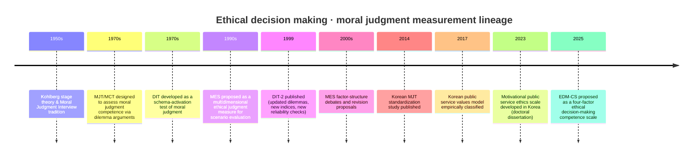

# 공공기관 종사자 대상 청렴 성향·윤리적 의사결정 및 도덕 판단 측정 설문도구 심층 정리

## Executive Summary

본 보고서는 공공기관(공기업·준정부기관·기타 공공기관) 및 공무원 집단에서 활용 가능성이 높은 **윤리적 의사결정(EDM)·도덕 판단/도덕 추론·청렴(Integrity) 성향** 측정 설문도구를, 원전(개발자 논문)·공식 웹사이트·매뉴얼 성격 문헌·검증 연구(국내·외)를 중심으로 정리하였다. 핵심 결론은 다음과 같다. citeturn9view1turn12search0turn12search4turn17view2turn6view4turn25view3turn6view1turn32view0

첫째, **도덕 판단/도덕 추론(‘moral judgment’)**을 ‘발달(스키마/단계) 관점’에서 비교적 표준화하여 측정하려면 **DIT-2**가 국제적으로 가장 널리 쓰이는 선택지이지만, **활용·채점이 센터의 채점 서비스에 종속**되는 점(접근성과 비용, 통제된 사용 조건)이 실무 적용의 큰 제약이 된다. citeturn12search0turn12search1turn14view0turn12search3

둘째, **MJT/MCT** 계열은 ‘선호(태도)’가 아니라 **반대 논증을 포함한 어려운 판단 과제 수행**을 통해 **도덕 판단 ‘역량(competence)’**을 구조적으로 산출한다는 점에서, 단순한 리커트 합산형 척도와 용도가 다르다. 한국어판 표준화 연구도 존재하나, 점수 해석/신뢰도 보고 방식이 일반 척도와 다르므로(예: α의 해석 한계) 연구 설계 단계에서 이를 명확히 해야 한다. citeturn9view1turn11view1turn7view0

셋째, 공공부문에서 실제로 가장 필요한 것은 “일반적 도덕 발달 점수”만이 아니라, **부패·공정·책임·품위·적극행정 등 ‘공직 맥락의 딜레마’에서 어떤 판단과 의도를 내리는지**인데, 이 목적에는 (1) 특정 시나리오에 대한 윤리적 판단을 다차원 기준으로 평가하는 **MES**(시나리오 기반) 또는 (2) 공공부문 맥락에서 요인구조를 구축한 국내 **공직윤리/청렴 동기 기반 척도**가 보완적으로 유용하다. 다만 국내 공직윤리 척도 개발 연구는 원문 접근성(학위논문/저작권) 때문에 실무자가 즉시 문항을 그대로 가져다 쓰기 어렵고, 사용 허가·재검증 문제가 뒤따를 수 있다. citeturn17view2turn22view3turn25view3turn26view0

넷째, “윤리적 의사결정 역량(competence)”을 Rest의 4요소(민감성–판단–동기–실행)식으로 **역량 구성요소 단위로** 측정하려는 시도는 최신 연구에서 **EDM-CS** 같은 형태로 나타나고 있으며, 기존의 ‘도덕 추론 점수’만으로는 포착하기 어려운 실행·동기 차원을 포함한다. 다만 현재까지는 특정 직역(예: 간호 대학생) 표본에서 개발·검증된 경우가 많아 **공공기관 종사자 표본으로의 재타당화가 전제**되어야 한다. citeturn6view4

아래에서는 (A) 국제 표준 도구 4종(MJT/MCT, DIT-2, MES, EDM-CS)과 (B) 한국 공공부문 맥락 도구 3종(동기론적 공직윤리 척도, 공직가치 모형 기반 측정, 공공기관 윤리의식 실험설문/조사 도구)을 각각 **도구별 표 + 1~2단락 요약**으로 정리하고, **비교표·타임라인·신뢰도 그래프**까지 제공한다. citeturn12search0turn9view1turn17view2turn32view0

## 연구 범위와 방법

정리의 초점은 “공공기관 종사자의 청렴 성향/윤리적 의사결정”이라는 적용 맥락을 전제로 하되, 공공부문 전용 척도가 항상 충분히 축적되어 있는 것은 아니므로, (1) 공공부문에서도 널리 전용·응용되는 **국제 표준화 도구**, (2) 한국 공공부문 법·제도 맥락을 반영하여 개발된 **국내 공직윤리/공직가치 측정**, (3) 공공기관 종사자의 윤리적 의사결정 행태를 실험설문으로 측정한 **정책연구 보고서형 도구**를 함께 포함하였다. citeturn12search4turn25view3turn32view0turn6view1

도구 선정의 최소 기준은 (a) 원전(개발 논문 또는 공식 소개/매뉴얼급 문헌) 존재, (b) 후속 검증(요인구조·신뢰도·타당도·집단차 검증 등) 근거 존재, (c) 공공부문 적용 가능성(시나리오 커스터마이징 가능, 또는 공직 맥락 문항 포함), (d) 접근성/저작권 조건이 명시될 것 등이다. citeturn12search0turn9view1turn17view2turn32view0

## 국제적으로 널리 사용되는 EDM·도덕 판단 측정 도구

### Moral Judgment Test, Moral Competence Test

| 항목 | 내용 |
|---|---|
| 도구명(영문·국문) | **Moral Judgment Test (MJT)** / **Moral Competence Test (MCT)**; 국내 문헌에서 “도덕판단력 측정도구(MJT)” 등으로 표기 citeturn7view0turn10search12 |
| 개발자·연도 | entity["people","Georg Lind","moral psychologist"]가 1970년대에 도덕교육 효과를 평가할 ‘역량’ 측정 도구 필요성에 따라 설계(문헌에서 Lind, 1978; Lind & Wakenhut, 1985로 원전 인용). citeturn9view1turn11view1 |
| 원전 및 주요 후속 검증(링크) | (원전/초기) Lind (1978), Lind & Wakenhut (1985) 언급. citeturn9view1  (방법론 정리/재진술) Lind의 dual-aspect 모델 기반 설명. citeturn11view1  (검증·운영 논점) Lind (2006) Psychological Reports 논문. citeturn9view1  (국문 표준화) entity["people","박건영","korean psych researcher 2014"]의 한국어판 표준화·타당화. citeturn7view0 |
| 측정 대상(적합 집단) | 표준형은 대체로 **10세 이상**에 적용 가능(아동~성인). 연구 적용 범위가 아동·청소년·대학생·직장인·전문직 등으로 확장되어 왔다는 점이 보고됨. citeturn11view1turn9view1 |
| 사용된 축·차원(정의) | 핵심 산출지표는 **C-index(C-score)**: 응답자가 논증을 평가할 때 ‘의견 일치’가 아니라 **논증의 도덕적 질(moral quality)**에 근거해 판단하는 정도를 구조적으로 산출하는 지표(‘역량’ 관점). 동시에 Kohlberg 유형/단계 선호에 대한 정보도 함께 산출 가능하다고 설명됨. citeturn9view1turn10search12turn11view1 |
| 문항 수·예시 문항(원문·번역) | 표준형은 **26개 반응 항목**으로 보고(두 개 딜레마: workers’ dilemma, doctor’s dilemma + 각 딜레마에 대한 찬·반 논증 평가). citeturn11view1  **응답 척도 예시(원문)**: “I strongly reject … I strongly accept” (−4 ~ +4). citeturn11view1  **번역(의역)**: “매우 반대 … 매우 찬성(수용)”(−4 ~ +4). |
| 신뢰도·타당도(수치) | (내적일관성) MJT는 고전적 문항내적일관성 최적화를 목적으로 설계되지 않았고, 응답 일관성 자체가 ‘오류’가 아니라 역량의 표현이 될 수 있다는 논지가 제시됨. citeturn9view1turn11view1  (안정성) 특정 연구에서 **test–retest r=0.90** 보고 언급. citeturn11view1  (국문 연구 보고) 한국어판 표준화 연구에서 **Cronbach’s α=0.669**가 보고됨. citeturn7view0 |
| 번역·문화적 타당화(한국어판) | 한국어판 표준화·타당화 연구가 보고되어 있음. citeturn7view0 |
| 사용 사례(요약) | 도덕/민주시민 교육 프로그램의 효과 평가(딜레마 토론 등)에 활용되었고, 다수 언어 버전 검증이 축적되었다는 요지가 제시됨. citeturn9view1turn11view1 |
| 장단점 및 적용 시 유의점 | **장점**: 태도 자기보고가 아니라 ‘반대 논증 평가’ 과제를 통해 역량을 구조적으로 산출한다는 점(프로그램 평가에 강점). citeturn9view1turn11view1  **유의점**: (1) 합산점수형 척도와 달리 채점·해석이 구조적이며, (2) 개인 선발/진단 목적 사용이 제한된다는 점이 명시됨. citeturn9view1 |
| 접근성(유료/무료·저작권) | “복사본은 저자에게서 무료로 제공” 가능하나, **개인 진단/선발 목적 사용은 허용되지 않는다**는 점이 명시됨. citeturn9view1 |

**요약 설명**  
MJT/MCT는 “도덕적으로 무엇이 옳은가”를 물어보는 태도 설문이라기보다, **반대 논증을 포함한 딜레마 자료에 대한 ‘논증 평가 과제’ 수행**을 통해 도덕 판단의 **역량(competence)**을 계산하는 도구로 제시된다. 따라서 공공기관 부패 예방 교육·청렴교육의 “전후 변화”를 평가하려는 목적(교육효과 검증)에서 특히 강점이 있다. citeturn9view1turn11view1  

다만 공공기관 인사평가/선발 등 **개인 선발 목적**으로는 사용 제한이 명시되어 있고, 점수 체계(C-index)·자료정제 기준을 연구 설계에서 명확히 해야 한다. 한국어판 표준화 연구가 존재하므로 국내 적용의 기반은 마련되어 있으나, 공공기관 표본에서의 재검증(측정불변성·준거타당도 등)은 별도로 설계하는 편이 안전하다. citeturn9view1turn7view0

### Defining Issues Test-2

| 항목 | 내용 |
|---|---|
| 도구명(영문·국문) | **Defining Issues Test, Version 2 (DIT-2)** / (직역) “정의(쟁점) 검사” 수준의 번역 표기가 국내에서 혼재(국내 문헌에서는 KDIT 등으로도 언급). citeturn12search4turn4search0 |
| 개발자·연도 | entity["people","James R. Rest","moral development theorist"], entity["people","Darcia Narvaez","moral psychology scholar"], entity["people","Stephen J. Thoma","DIT researcher"], entity["people","Muriel J. Bebeau","moral education researcher"](1999) 개발/검증 논문에서 DIT-2를 개정 도구로 제시. citeturn13view0 |
| 원전 및 주요 후속 검증(링크) | (원전) Rest et al. (1999) “DIT2: Devising and testing a revised instrument of moral judgment” citeturn13view0turn14view0  (공식 소개/운영) entity["organization","앨라배마 대학교 윤리발달연구센터","tuscaloosa, AL, US"] 공식 FAQ/설명 페이지. citeturn12search0turn12search1turn12search5  (구조 타당도) 2020년 PLOS ONE 요인분석 기반 구조 검증. citeturn12search3turn12search12 |
| 측정 대상(적합 집단) | 전공·직역 전반에서 도덕 판단/도덕 추론(스키마)을 측정하는 표준 도구로 소개되며, 교육 개입(윤리교육) 효과 평가에 광범위하게 사용되는 것으로 정리됨. citeturn12search4turn12search1 |
| 사용된 축·차원(정의) | DIT-2는 3개 발달적 스키마(개인적 이익/개인관계 중심, 규범 유지, 후기-관습/원리 중심)를 전제로 도덕 판단의 구조를 측정한다고 설명됨. citeturn13view0turn12search4turn12search12 |
| 문항 수·예시 문항(원문·번역) | **5개 딜레마**로 구성되며, 각 딜레마 뒤에 다수의 고려사항(진술)을 **중요도 평가(rating)**하고 상위 항목을 **순위(ranking)**로 선택하는 형식으로 설명됨. citeturn12search0turn12search4turn13view0  ※ DIT-2는 저작권/운영기관 정책상 문항 전문을 보고서에 그대로 재수록하기가 곤란하므로, 원문은 공식 주문/채점 서비스 경로를 따르는 것이 원칙. citeturn12search0turn12search8 |
| 신뢰도·타당도(수치) | Rest et al.(1999)에서 **DIT2-N2의 Cronbach’s α=0.81**(5개 스토리 단위), DIT1-P는 0.76로 보고. citeturn14view0turn14view3  타당도는 (1) 연령/교육수준 집단 차, (2) 공공정책 태도 예측, (3) DIT1과 상관 등 기준으로 제시. citeturn13view0turn14view3  내부구조 타당도는 CFA/bi-factor로 지지된다는 결론이 보고됨. citeturn12search3turn12search12 |
| 번역·문화적 타당화(한국어판) | 국내 연구에서 **KDIT(한국판 DIT)** 사용 언급이 있으며, 간호대학생 표본에서 도덕 판단·윤리적 가치관 연구에 활용된 사례가 보고됨. citeturn4search0turn4search1 |
| 사용 사례(요약) | 윤리교육 개입(예: 학기 단위 윤리교육)의 효과를 평가하는 도구로 широко 사용되며, 온라인/지필 설문 형태로 운영 가능하다고 설명됨. citeturn12search4turn12search0 |
| 장단점 및 적용 시 유의점 | **장점**: 국제적으로 규범 자료·검증 축적이 매우 크고, 도덕 추론의 발달적 차이를 비교하는 연구에 적합. citeturn12search1turn12search3  **유의점**: DIT-2는 **센터 채점 서비스로만 제공되며 연구자가 자체 채점할 수 없다는 점**(운영·비용·데이터 보안·연구 일정에 직접 영향). citeturn12search0turn12search13 |
| 접근성(유료/무료·저작권) | DIT-2는 채점 서비스와 함께 제공(연구자 자체 채점 불가). DIT-1은 점수(P-score) 산출 매뉴얼을 별도 구매할 수 있다고 안내됨. citeturn12search0turn12search8 |

**요약 설명**  
DIT-2는 “도덕적 판단 발달”을 **스키마(개인적 이익–규범 유지–후기 관습/원리)** 관점에서 측정하는 대표 도구로, 개발 논문에서 신뢰도(스토리 단위 α)와 연령·교육수준 차, 공공정책 태도와의 관련 등 타당도 기준을 체계적으로 제시한다. citeturn13view0turn14view0turn14view3  

공공기관 연구에서 DIT-2는 “청렴 성향” 자체라기보다 **도덕 추론/정당화 구조**를 측정하는 도구이므로, 부패행위 억제·공정성 판단 등 정책적 변수를 직접 설명하려면 (a) 시나리오 기반 윤리 판단 도구(MES 등) 또는 (b) 공직윤리 동기/규범 내면화 척도와 **병행 설계**하는 전략이 흔히 더 설명력이 높다. 실무적으로는 DIT-2 접근·채점이 운영기관 정책에 종속되므로, 예산·일정·자료관리(외부채점)까지 포함한 운영계획을 선행 확정해야 한다. citeturn12search0turn12search4turn25view3

### Multidimensional Ethics Scale

| 항목 | 내용 |
|---|---|
| 도구명(영문·국문) | **Multidimensional Ethics Scale (MES)** / “다차원적 윤리척도(다차원 윤리지표)”로 번역·인용되는 사례가 보고됨. citeturn17view2turn23search0 |
| 개발자·연도 | entity["people","R. Eric Reidenbach","marketing scholar"] & entity["people","Donald P. Robin","business ethics scholar"], 1990년 JBE 논문에서 8문항 3차원(Moral equity/Relativism/Contractualism)로 정제·제시. citeturn17view2 |
| 원전 및 주요 후속 검증(링크) | (원전) Reidenbach & Robin (1990) JBE: 33문항에서 8문항으로 정제, 3차원 제시. citeturn17view2  (후속 검토/비판·개정) Hyman(1996) critique & revision: MES 사용 연구 누적과 복제 문제·개정안 제시. citeturn17view3turn18view0  (심리측정 검토·요인구조 논의) McMahon(2002) 학위논문에서 MES(8-item) 요인구조와 신뢰도 보고. citeturn20view0turn22view3turn21view3 |
| 측정 대상(적합 집단) | 본질적으로 **특정 시나리오(윤리적 딜레마)에 대한 평가**를 묻기 때문에, 시나리오를 공공기관 부패·이해충돌·특혜·공정채용 등으로 설계하면 공공부문 종사자에도 적용 가능(도구 자체는 직역 일반). citeturn17view2turn20view0 |
| 사용된 축·차원(정의) | 원전 논문은 8문항이 **Moral equity(정의/공정·도덕적 정당성 평가)**, **Relativism(문화/전통적 수용 가능성)**, **Contractualism(암묵적 약속/계약 위반 여부)** 차원으로 구성된다고 요약. citeturn17view2 |
| 문항 수·예시 문항(원문·번역) | 8개 의미분별(semantic differential) 문항이 제시되며, 예: **Just/Unjust(정의/부정의)**, **Fair/Unfair(공정/불공정)**, **Morally Right/Not Morally Right(도덕적으로 옳음/옳지 않음)**, **Culturally Acceptable/Unacceptable(문화적으로 수용/비수용)**, **Does Not Violate/Violates Unwritten Contract(암묵적 계약 위반 아님/위반)** 등. citeturn22view0turn22view3turn17view2 |
| 신뢰도·타당도(수치) | McMahon(2002) 연구에서 8-item MES를 시나리오·조건에 걸쳐 집계했을 때 **α=0.92**로 보고되며, 각 문항의 총점 상관도도 제시됨. citeturn22view3turn22view0  다만 후속 문헌은 3요인 해(또는 2요인 해) 재현 실패, 복제 연구에서 요인 통합(예: moral equity+relativism) 등 **요인구조 불안정성** 논점을 제기. citeturn17view3turn21view3 |
| 번역·문화적 타당화(한국어판) | 국내 연구에서 MES 기반 “다차원 윤리척도”를 활용해 윤리적 사상/판단/행동의도 관계를 분석한 사례가 보고됨(예: 세무전문가·세무대리인 집단). citeturn24view0turn24view1 |
| 사용 사례(요약) | 원전 이후 다수 연구에서 윤리 판단 측정에 사용되었고, 비판 논문은 ‘적어도 10편 이상’의 실증연구 축적과 함께 복제 실패·요인구조 논쟁이 존재함을 정리. citeturn17view3turn21view3 |
| 장단점 및 적용 시 유의점 | **장점**: 공공기관에 맞춘 **윤리 딜레마 시나리오를 설계**하면, 단일 “윤리성” 점수가 아니라 (공정/정당성, 문화규범, 계약/약속 위반) 관점의 판단을 분해해 볼 수 있음. citeturn17view2turn22view0  **유의점**: (1) 시나리오 구성에 따라 요인구조/문항 작동이 달라질 수 있고, (2) MES의 요인구조 재현성에 비판이 존재하므로 공공기관 표본에서 **CFA/측정불변성** 재검증 권고. citeturn17view3turn21view3 |
| 접근성(유료/무료·저작권) | 문항 자체는 학술문헌에 널리 인용·재수록되어 왔으나, 원문 재인용/설문지 배포 시에는 출처 표기 및 저작권 정책 확인이 필요. citeturn17view2turn17view3 |

**요약 설명**  
MES는 공공기관 종사자의 “청렴 성향”을 성격특성처럼 묻기보다는, 구체적인 상황(예: 특혜 제공, 청탁, 정보 유출, 이해충돌 등)에서 **‘그 행동이 얼마나 정당/공정한가·문화적으로 수용 가능한가·약속/계약 위반인가’**를 다차원으로 평정하게 하여 윤리 판단의 근거를 분해한다는 점에서 공공부문 연구 설계에 잘 맞는다. citeturn17view2turn22view0  

반면 “MES의 요인구조가 항상 3요인으로 재현되는가”는 후속 비판·재검증 문헌에서 논쟁적이므로, 공공기관 표본으로 적용할 때는 (a) 시나리오를 최소 2~3개 이상 준비해 문항 작동을 비교하고, (b) 요인구조(CFA)·신뢰도·준거타당도(부패경험/신고의도/조직공정성 등) 검증을 함께 설계하는 방식이 권장된다. citeturn17view3turn21view3turn32view0

### Ethical Decision-Making Competence Scale

| 항목 | 내용 |
|---|---|
| 도구명(영문·국문) | **Ethical Decision-Making Competence Scale (EDM-CS)** / (직역) “윤리적 의사결정 역량 척도”. citeturn6view4 |
| 개발자·연도 | 2025년 개발 논문(간호교육 맥락에서 개발 보고). citeturn6view4 |
| 원전 및 주요 후속 검증(링크) | (원전) 2025년 간호교육 분야 개발·검증 논문(PubMed 등재 초록에서 핵심 수치 제공). citeturn6view4  (번안/타문화 검증) 2025년 BMC Nursing에 터키어 버전 타당화 연구가 보고됨. citeturn5search4 |
| 측정 대상(적합 집단) | 원전 개발 표본은 **간호대학생**(교육 맥락). 공공기관 종사자 적용은 원칙적으로 **재타당화 필요**. citeturn6view4turn5search4 |
| 사용된 축·차원(정의) | 4요인 구조: **ethical judgement, ethical sensitivity, ethical motivation, ethical action**으로 보고. (일반적으로 ‘민감성–판단–동기–실행’ 구성요소로 윤리적 의사결정 역량을 분해하려는 접근에 해당). citeturn6view4 |
| 문항 수·예시 문항(원문·번역) | 34문항에서 9문항 삭제 후 **25문항**(4요인) 보고, 2차 요인모형에서는 **18문항**로 확인되었다고 서술됨. citeturn6view4  ※ 문항 원문은 학술지 본문/부록에 제시될 가능성이 크며, 보고서에는 저작권 준수를 위해 문항 전문을 전재하지 않음. citeturn6view4 |
| 신뢰도·타당도(수치) | 전체 척도 **α=0.90**, 하위요인 α는 **0.73~0.80** 범위로 보고. citeturn6view4  수렴타당도 예로 “protective factor scale”과의 상관 **r=0.47** 보고. citeturn6view4 |
| 번역·문화적 타당화(한국어판) | 현재 보고서 범위에서 한국어판 타당화 자료는 확인되지 않음(추가 탐색/번안 연구 필요). citeturn6view4 |
| 사용 사례(요약) | 교육과정(윤리교육)에서 학습성과(역량) 평가 도구로 설계된 맥락이 강함(표본·검증이 교육 집단 중심). citeturn6view4 |
| 장단점 및 적용 시 유의점 | **장점**: “도덕 추론 점수”가 아니라 **의사결정 역량을 구성요소 단위로 분해**(판단·민감성·동기·실행)해 교육/개입과 연결하기 용이. citeturn6view4  **유의점**: 공공기관(공무원/공기업) 표본에서의 타당화(요인구조·준거·불변성)를 선행하지 않으면 결과 해석의 외삽 위험이 큼. citeturn5search4turn6view4 |
| 접근성(유료/무료·저작권) | 학술지 저작권 범위 내에서 도구 문항 활용/재수록 시 사용 허가·출처 표기가 필요할 수 있음. citeturn6view4 |

**요약 설명**  
EDM-CS는 “윤리적 의사결정”을 단일 점수로 뭉뚱그리지 않고, **판단·민감성·동기·실행**으로 분해한 4요인 구조를 제시한다는 점에서 공공기관의 청렴·윤리 프로그램(교육/캠페인/제도개선)의 설계 및 성과평가 프레임과 잘 결합될 여지가 있다. citeturn6view4  

그러나 현재 근거는 특정 교육집단(간호대학생) 기반에 가깝기 때문에, 공공기관 종사자를 대상으로 사용할 경우에는 (a) 공직 딜레마에 맞는 준거변수(부패행위 허용도, 신고의도, 적극행정 위험감수 등) 설계, (b) 요인구조(CFA) 재확인, (c) 직급/직무/기관유형별 측정불변성 검증 등 “이식 타당화” 과정을 별도 프로젝트로 두는 것이 안전하다. citeturn6view4turn25view3turn32view0

## 한국 공공부문 맥락에서 활용되는 청렴·공직윤리 관련 도구

### 동기론적 공직윤리 척도

| 항목 | 내용 |
|---|---|
| 도구명(영문·국문) | “Public Service Ethics Scale Based on the Perspective of Motivational Ethics” / “동기론적 공직윤리(공직윤리) 척도”로 개발·타당화 보고. citeturn26view0turn25view3 |
| 개발자·연도 | entity["people","김상우","public admin phd 2023"], 2023년 박사학위논문(상명대학교). citeturn26view0turn25view3 |
| 원전 및 주요 후속 검증(링크) | (원전) RISS 서지/초록. citeturn26view0turn26view1  (DBpia 초록·절차 요약) 문항 생성–내용타당도–EFA–CFA–고차CFA 절차와 요인명 제시. citeturn25view3 |
| 측정 대상(적합 집단) | “윤리 관련 업무를 수행하는 중앙행정기관 소속 공무원”을 대상으로 본조사(표본 128) 실시로 보고. citeturn25view3turn26view1 |
| 사용된 축·차원(정의) | 최종 4요인: **passive sincerity(소극적 성실)**, **active sincerity(적극적 성실)**, **responsibility(책임)**, **integrity(청렴/진실성)**을 ‘동기론적 공직윤리’의 하위요인으로 명명했다고 보고. citeturn25view3 |
| 문항 수·예시 문항(원문·번역) | 예비문항 44개 → 내용타당도 분석 후 35개 문항 추출, 요인적재 기준으로 일부 문항 삭제 후 요인 확정 과정을 보고(표지변수 2개 포함 설문 46문항 구성도 언급). citeturn25view3turn26view1  ※ 문항 원문은 학위논문 본문/부록에 있을 가능성이 높으나, 본 보고서에서는 원문 접근 제한으로 문항 전문·번역을 제시하지 못함(원문 확인 필요). citeturn26view0turn25view3 |
| 신뢰도·타당도(수치) | EFA 및 1차 CFA, 고차 CFA로 다차원 구조를 확인했다고 보고되나, 초록 수준에서는 α/CR/AVE 등 구체 수치가 제시되지 않음(원문 확인 필요). citeturn25view3turn26view1 |
| 번역·문화적 타당화(한국어판) | 한국 개발 도구(한국어가 원언어). citeturn26view0 |
| 사용 사례(요약) | 공직윤리를 “부패 방지”와 동일시하는 법·실무 중심 접근의 한계를 지적하고, 성실/친절·공정/품위유지 의무(법 분석)와 연계해 동기 기반 공직윤리 구성개념을 도출했다고 요약됨. citeturn25view3turn26view1 |
| 장단점 및 적용 시 유의점 | **장점**: 공직 맥락(공무원 의무·적극행정 등)을 반영해 ‘청렴/성실/책임’ 중심으로 요인을 구축했다는 점. citeturn25view3  **유의점**: (1) 학위논문 도구는 저작권/사용 허가가 쟁점이 될 수 있고, (2) 다른 공공기관 유형(공기업·준정부)으로 일반화하려면 재타당화가 필요. citeturn26view0turn25view3 |
| 접근성(유료/무료·저작권) | RISS에서 “저작권 보호”가 명시되어 있고, DBpia 역시 저작권 보호 안내가 있음(원문 접근은 소장기관/서비스 정책에 따름). citeturn26view0turn25view3 |

**요약 설명**  
이 도구는 국제표준 도덕 발달 검사(DIT-2)처럼 “발달 단계/스키마”를 측정하기보다, 한국 공직 맥락에서 공직윤리를 “사후 처벌 중심의 부패 방지”로만 다루는 접근을 넘어, **성실·책임·청렴 등의 ‘윤리적 동기/의무 내면화’**를 다차원 구조로 측정하려는 시도라는 점에서 정책·조직관리 현장과 접점이 크다. citeturn25view3turn26view1  

다만 현재 확보된 정보는 초록·서지 수준이므로, 실무 설문에 곧바로 투입하려면 **원문에서 문항·신뢰도/타당도 수치·최종 문항 목록·채점 규칙**을 확인한 뒤, 공공기관 유형별(중앙부처/지자체/공기업)로 **측정불변성·준거타당도(부패행위 경험/신고의도/조직청렴도 인식 등)**를 추가 검증하는 것이 필요하다. citeturn25view3turn32view0

### 공직가치 모형 기반 측정

| 항목 | 내용 |
|---|---|
| 도구명(영문·국문) | “Public Service Values/공직가치” 측정(공직가치 ‘모형’ 및 유형 제시). citeturn6view1 |
| 개발자·연도 | entity["people","김상묵","korean public admin scholar"], 2017년 연구에서 한국적 공직가치 모형을 실증적으로 분류·제시. citeturn6view1 |
| 원전 및 주요 후속 검증(링크) | (원전) “공직가치 모형의 실증분류와 인사관리 함의” KCI 등재 논문. citeturn6view1 |
| 측정 대상(적합 집단) | “국가공무원 648명 설문조사” 기반으로 공직가치를 5유형으로 분류했다고 보고. citeturn6view1 |
| 사용된 축·차원(정의) | 5유형: **윤리적 가치(ethical)**, **민주적 가치(democratic)**, **혁신적 가치(innovative)**, **전문직업적 가치(professional)**, **전통적 가치(traditional)**로 분류했다고 제시. citeturn6view1 |
| 문항 수·예시 문항(원문·번역) | 초록 수준에서는 문항 목록/예시 문항이 제공되지 않음(원문 확인 필요). citeturn6view1 |
| 신뢰도·타당도(수치) | 초록 수준에서는 α/CFA 적합도 등 수치가 확인되지 않음(원문 확인 필요). citeturn6view1 |
| 번역·문화적 타당화(한국어판) | 한국 공직 맥락 기반(한국어). citeturn6view1 |
| 사용 사례(요약) | 공직가치 유형에 따라 인사관리(채용·교육·평가 등) 함의가 달라질 수 있다는 논지를 전개. citeturn6view1 |
| 장단점 및 적용 시 유의점 | **장점**: “청렴/윤리”를 공직 정체성·민주성·전문성·혁신성까지 포함한 가치 프레임으로 확장해 인사정책과 연결 가능. citeturn6view1  **유의점**: 윤리적 의사결정 ‘행태/상황판단’ 측정보다는 가치지향 측정에 가까워, 부패 딜레마/신고의도 등 행동지표와는 별도 연결 설계가 필요. citeturn32view0turn6view1 |
| 접근성(유료/무료·저작권) | 학술지 저작권 범위 내 이용(원문 접근 정책에 따름). citeturn6view1 |

**요약 설명**  
공직가치 모형 기반 측정은 “청렴 성향”을 좁게 정의하기보다, 공공부문 종사자의 가치를 **윤리·민주·혁신·전문·전통**으로 분류해 제도/인사관리 설계에 접목하려는 접근이다. 따라서 공공기관에서 “윤리적 의사결정”을 직접 측정하기보다는, 가치 기반 인사관리(교육·리더십·평가) 연구에서 **설명변수(예: 윤리적 가치 지향)**로 활용하는 그림이 자연스럽다. citeturn6view1  

다만 부패 행위 억제, 내부고발, 적극행정 위험감수 등과 같은 **구체 행태**와 연결하려면, 가치 척도만 단독 사용하기보다는 KIPF 보고서처럼 행태/의사결정 실험설문 또는 시나리오 기반 판단 척도(MES 등)와 결합해 “가치 → 판단 → 행동의도/행동” 경로를 함께 추정하는 방식이 더 적합하다. citeturn32view0turn22view0

### 공공기관 종사자의 윤리의식·윤리적 의사결정 실험설문 도구

| 항목 | 내용 |
|---|---|
| 도구명(영문·국문) | (연구보고서 기반) “공공기관 종사자의 윤리의식(윤리적 의사결정) 측정” 실험설문/조사도구(정책연구 보고서 21-18). citeturn32view0turn30view0 |
| 개발자·연도 | entity["organization","한국조세재정연구원","sejong, kr"] 연구보고서(2021년 발간 정보·2022년 공개 metadata). 저자: 하세정·박한준·조윤직. citeturn32view0turn30view0 |
| 원전 및 주요 후속 검증(링크) | NKIS 보고서 상세(국문초록·목차 제공). citeturn32view0turn34view0  KIPF OAK 리포지터리 메타데이터(다운로드 링크 제공되나 기술적 오류 가능). citeturn30view0 |
| 측정 대상(적합 집단) | 공공기관 직원의 윤리의식 및 윤리적 의사결정 행태(부패행위 선택/내부고발 등)를 측정하는 연구로 요약됨. citeturn32view0 |
| 사용된 축·차원(정의) | 보고서 요약에 따르면 “윤리의식 수준”과 “윤리적 의사결정 행태(실험설문)”를 측정하고, 공공봉사동기, 조직정치 수준, 부패방지교육 적극성, 처벌 적정성, 감사 빈도, 처리과정 신뢰성 등 요인과의 상관/영향을 분석. citeturn32view0turn34view0 |
| 문항 수·예시 문항(원문·번역) | NKIS 페이지는 설문 항목 전문을 제공하지 않으며, 보고서 원문 다운로드가 별도 절차(이용조건 동의)를 요구함. citeturn34view0turn32view0 |
| 신뢰도·타당도(수치) | NKIS 초록 범위에서는 문항 수준 신뢰도/타당도 수치가 제시되지 않음(원문 확인 필요). citeturn32view0turn34view0 |
| 번역·문화적 타당화(한국어판) | 한국어 정책연구 보고서(한국 공공기관 맥락 내 설계). citeturn32view0 |
| 사용 사례(요약) | “민간기업 대비 공공기관이 전반적으로 더 윤리적인 의사결정을 내린다”는 실험설문 결과 요지와, 부패행위 억제·신고 관련 정책적 시사점(교육, 공정한 처리과정, 처벌 적정성 등)을 제시. citeturn32view0turn34view0 |
| 장단점 및 적용 시 유의점 | **장점**: 공공기관의 핵심 관심(부패행위 선택·신고)을 직접 측정하는 설계로, “윤리 발달 점수”보다 정책변수와 직접 연결. citeturn32view0turn34view0  **유의점**: 설문 항목이 공개·재사용 가능한 ‘검증 척도’ 형태인지, 또는 보고서 한정 실험설문인지(저작권·재현성) 확인이 필요. citeturn34view0turn30view0 |
| 접근성(유료/무료·저작권) | NKIS에서 “공공누리 4유형(출처표시+상업적 이용 금지+변경금지)”이 명시됨. citeturn32view0 |

**요약 설명**  
KIPF 보고서의 실험설문 접근은 “윤리적 의사결정”을 공공기관의 실제 이슈(부패 참여·내부고발·처리 신뢰성)와 직접 연결한 정책 연구 설계라는 점에서, 공공기관 종사자 대상 설문 설계에 매우 실무적이다. 특히 “공공봉사동기, 부패방지교육, 처리과정 신뢰성, 처벌 적정성” 등 제도/조직 변수와 부패 선택·신고의 상관을 보고하는 방식은 향후 기관별 청렴정책 평가 설계를 구체화하는 데 참고가 된다. citeturn32view0turn34view0  

다만 이 보고서의 설문이 ‘표준화 척도(심리측정 도구)’로서 재사용 가능한지, 또는 보고서 목적에 맞게 구성된 실험설문인지에 따라, 실무자가 재활용할 때 필요한 절차(문항 사용 허가, 재타당화, 원문 문항 공개 범위)가 크게 달라진다. NKIS가 제시하는 이용조건(출처표시+비상업+변경금지)도 함께 고려해야 한다. citeturn32view0turn34view0

## 비교 분석 및 선택 가이드

### 도구별 핵심 비교표

| 구분 | 무엇을 직접 측정하나 | 대표 차원(요약) | 문항/반응단위 | 보고된 신뢰도 예시 | 한국어판/국내근거 | 접근성·라이선스 요지 |
|---|---|---|---|---|---|---|
| MJT/MCT | 도덕 판단 **역량(competence)**(논증의 도덕적 질에 근거한 평가) | C-index, 단계/유형 선호 | 표준형 26 반응항목(2 딜레마) | 한국어판 α=0.669(보고) | 한국어판 표준화 연구 존재 | 무료 제공 언급, 개인 선발/진단 목적 제한 |
| DIT-2 | 도덕 판단 발달(스키마) | 개인적 이익/규범 유지/후기 관습 | 5 딜레마 기반 평가·순위 | α=0.81(스토리 단위) | KDIT 사용 언급(분야별) | 센터 채점 서비스 종속(자체 채점 불가) |
| MES | 특정 시나리오에 대한 윤리 판단(다차원 근거) | moral equity/relativism/contractualism | 시나리오당 8개 의미분별 | α=0.92(연구 예시) | 국내 다양한 분야에서 활용 | 문항 전재/재배포 시 저작권 확인 |
| EDM-CS | 윤리적 의사결정 **역량 구성요소** | 민감성/판단/동기/실행 | 25문항(보고), 2차요인 18 | α=0.90(전체), 0.73~0.80(하위) | 한국어판 근거 미확인 | 학술지 저작권 범위·재타당화 필요 |
| 동기론적 공직윤리 척도 | 공직 맥락의 성실·책임·청렴 동기 | 소극적/적극적 성실, 책임, 청렴 | 최종 35문항(보고) | (초록 기준 수치 미제시) | 한국 개발(중앙부처 공무원 표본) | 학위논문 저작권·사용 허가/재검증 이슈 |
| 공직가치 모형 측정 | 공직 가치지향(인사관리 프레임) | 윤리/민주/혁신/전문/전통 | (초록 기준 문항수 미제시) | (초록 기준 수치 미제시) | 한국 개발(국가공무원 설문) | 학술지 접근 정책에 따름 |
| KIPF 실험설문 | 공공기관 윤리의식·부패 선택/신고 행태 | 윤리의식, 부패 참여/신고, 제도요인 | (NKIS 기준 문항 미공개) | (초록 기준 수치 미제시) | 한국 공공기관 정책연구 | 공공누리 4유형(비상업·변경금지 등) |

위 표의 근거(신뢰도·문항수 등)는 각 원전/검증 문헌에서 직접 인용된 값만 반영했으며, 초록·메타데이터 범위에서 수치를 확인할 수 없는 항목은 “미제시”로 표시했다. citeturn7view0turn11view1turn14view0turn12search0turn22view3turn6view4turn25view3turn6view1turn32view0

### 신뢰도(보고된 Cronbach’s α) 비교 그래프

아래 그래프는 각 도구의 대표 연구에서 보고된 내적일관성(α) 값을 “예시”로 비교한 것이다. (MJT/MCT는 구조적 점수 산출 도구이므로 α 비교의 의미가 제한될 수 있다는 점은 별도 유의해야 한다.) citeturn11view1turn7view0turn14view0turn22view3turn6view4

### 도구 간 관계와 계보 타임라인

(각 연혁의 세부 근거는 원전·검증 문헌에 기반.) citeturn9view1turn13view0turn17view2turn17view3turn7view0turn6view1turn25view3turn6view4

### 공공기관 설문 설계 관점의 선택 가이드

공공기관 종사자의 “청렴 성향/윤리적 의사결정”을 실제로 측정하려면, (i) **도덕 판단의 발달/역량**, (ii) **업무 맥락의 딜레마 판단**, (iii) **청렴/성실/책임의 내면화(가치·동기)**라는 서로 다른 구성개념을 구분해 설계하는 편이 결과 해석이 안정적이다. citeturn25view3turn12search4turn11view1turn17view2turn32view0

- “윤리교육의 **전후 변화**를 엄밀히 보고 싶다”면: MJT/MCT가 프로그램 평가에 민감하다는 논지와 함께 사용 제한(선발·진단 금지)을 동시에 고려해야 한다. citeturn9view1turn11view1  
- “국제 비교·발달 수준 비교가 필요”하다면: DIT-2는 검증 축적이 강점이지만, 센터 채점 서비스 종속이 운영 리스크다. citeturn12search0turn14view0turn12search3  
- “공공부문 부패·공정 딜레마에서의 **판단과 행동의도**를 직접 보고 싶다”면: 공공부문 시나리오를 구성한 MES(또는 KIPF 방식의 실험설문)가 더 직접적인 설계로 이어지며, 요인구조 재검증을 병행하는 것이 안전하다. citeturn22view0turn17view3turn32view0  
- “청렴·책임·성실 같은 공직윤리의 **동기/가치 지향**을 인사관리·조직문화와 연결하고 싶다”면: 국내 공직윤리·공직가치 도구가 적합하되, 문항 재사용/저작권·기관 유형별 재검증이 필수 쟁점이 된다. citeturn25view3turn6view1turn26view0

## 참고문헌과 원문 링크

아래 항목은 보고서에서 직접 활용한 “원전/공식/검증” 자료(영문·국문 혼합)이며, 각 인용은 원문 링크로 연결된다.

- MJT/MCT 핵심 이론·검증: Lind의 MJT 논점 정리(2006) citeturn9view1  
- MJT/MCT 구조·문항 형식(dual-aspect model 기반 기술) citeturn11view1  
- MJT 한국어판 표준화·타당화(국문) citeturn7view0  
- DIT-2 개발/검증 원전(1999) citeturn13view0  
- DIT/DIT-2 공식 운영기관 FAQ 및 소개(채점 서비스, 신뢰도 개요, 버전 차이) citeturn12search0turn12search1turn12search8  
- DIT-2 내부구조(요인) 타당도 검증(PLOS ONE, 2020) citeturn12search3turn12search12  
- MES 원전(1990) 초록/차원 요약 citeturn17view2  
- MES 비판·개정 제안(Hyman, 1996) citeturn17view3  
- MES(8-item) 신뢰도·문항 제시(학위논문 기반 심리측정 검토) citeturn22view3turn22view0turn21view3  
- EDM-CS 개발·신뢰도/수렴타당도(PubMed 요약) citeturn6view4  
- 한국 공직윤리 척도 개발(동기론적 공직윤리) RISS 서지·초록 citeturn26view0turn26view1  
- 동기론적 공직윤리 척도 개발 절차·요인명(초록) citeturn25view3  
- 한국 공직가치 모형 실증분류(2017) citeturn6view1  
- 공공기관 종사자의 윤리의식·윤리적 의사결정(정책연구 보고서) NKIS 상세/초록 citeturn32view0turn34view0